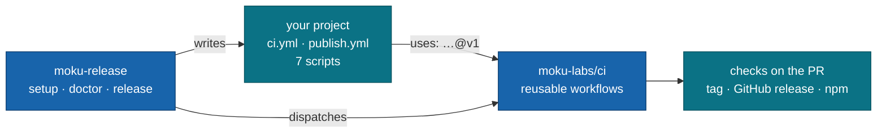

<div align="center">

# @moku-labs/ci

**One CI and release pipeline for every moku package.**

Reusable GitHub workflows pinned by tag, plus the `moku-release` CLI that installs them
into a project and runs a release. A project keeps two 20-line files and seven scripts;
everything else lives here, once. Not a build tool and not a framework — it calls your
`package.json` scripts and never the tools behind them.

<br/>

[](https://www.npmjs.com/package/@moku-labs/ci)
[](https://github.com/moku-labs/ci/actions/workflows/self-test.yml)
[](#versioning)
[](#requirements)
[](./LICENSE)

<br/>

[Install](#install) ·
[How it works](#how-it-works) ·
[Workflows](#workflows) ·
[CLI](#cli) ·
[The contract](#the-contract) ·
[Versioning](#versioning) ·
[Scripts](#scripts)

</div>

---

## Install

```sh
bun add -d @moku-labs/ci
bun run release:setup
```

`setup` writes the two workflow files, adds the missing scripts, does the first publish,
registers the trusted publisher and applies the branch ruleset. Run it again any time — it
only does what is still missing.

> [!NOTE]
> **Status: `1.x`, early.** `package-ci.yml`, `package-release.yml` and `moku-release release`
> ship this package itself: `1.1.1` was the first live release, tokenless and with provenance.
> `moku-release setup` has passed dry-run and unit tests only.

> [!IMPORTANT]
> Two steps are yours alone. The CLI never handles a credential, and there is no `NPM_TOKEN`
> anywhere — publishing is tokenless OIDC.
>
> ```sh
> gh auth login
> npm login
> ```

## Why @moku-labs/ci

- **One copy of the pipeline.** Seven repos had seven different `ci.yml` and six different
  `publish.yml`. A fix now lands here and reaches every project through the `@v1` tag.
- **Scripts are the interface, not tools.** The workflows call `bun run lint`, never `biome`.
  A project with special needs changes its own script, not the central YAML.
- **The CLI and its templates are one package.** `moku-release` reads `examples/` and
  `rulesets/` from its own install. There is no second copy to drift.
- **No tokens.** npm Trusted Publishing with `id-token: write`. Build and publish run in
  separate jobs, so no dependency's postinstall ever sees the credential.
- **Not a dependency of your app.** A dev dependency with zero runtime dependencies of its
  own, so even `@moku-labs/core` can use it without a cycle.

## How it works



1. `release:setup` writes two thin callers into `.github/workflows/`.
2. Every PR runs `package-ci.yml`: four jobs, reported as `ci / lint`, `ci / types`,
   `ci / test`, `ci / build`.
3. `release patch` dispatches `publish.yml`, which calls `package-release.yml`:
   check → tag → pack → publish. The CLI watches the run and verifies the version on npm.

## Workflows

| Workflow | Called from | Jobs | Inputs (all optional) |
|---|---|---|---|
| [`package-ci.yml`](.github/workflows/package-ci.yml) | [`examples/package/ci.yml`](examples/package/ci.yml) | `lint` · `types` · `test` · `build` | `runs_on`, `bun_version`, `validate` |
| [`package-release.yml`](.github/workflows/package-release.yml) | [`examples/package/publish.yml`](examples/package/publish.yml) | `check` → `release` → `package` → `publish` | `release_type`, `publish`, `runs_on`, `bun_version`, `node_version`, `artifact_name`, `validate` |
| [`app-deploy.yml`](.github/workflows/app-deploy.yml) | [`examples/app/ci.yml`](examples/app/ci.yml) | `validate` → `deploy` to Cloudflare | script names (`lint_script`, `build_script`, `deploy_script`, …) and two required secrets |
| [`self-test.yml`](.github/workflows/self-test.yml) | this repo only | `actionlint` over workflows and examples | — |

`package-release.yml` outputs `tag`, `version`, `prev_tag` and `artifact_name`.

| Other file | What it is |
|---|---|
| [`examples/package/publish.local-publish.yml`](examples/package/publish.local-publish.yml) | Fallback: publish from the project's own job. Use it only if the central publish fails npm auth. |
| [`rulesets/main.json`](rulesets/main.json) | Branch ruleset for `main`: PR only, no force-push, the four `ci / …` checks required. |

> [!TIP]
> A Layer-3 app copies `examples/app/ci.yml` by hand and needs a `deploy` script. The CLI
> sets up packages only.

## CLI

| Command | When | What it does |
|---|---|---|
| `bun run release:setup` | once per project | Idempotent wizard: workflows, script contract, first publish, first tag, trusted publisher, branch ruleset, then `doctor`. `--dry-run` prints every action and changes nothing. |
| `bun run release:doctor` | any time | Read-only. Eleven checks, one line each, and the exact `fix:` command for every red line. `--json` for machines. |
| `bun run release <patch\|minor\|major\|prerelease>` | each release | Refuses unless the tree is clean and `HEAD == origin/main`. Dispatches `publish.yml`, watches the run, verifies the version and dist-tag on npm. |

The scripts are plain aliases of the `moku-release` bin. Internals and the list of checks:
[src/README.md](src/README.md).

## The contract

A package exposes exactly these seven scripts. `setup` adds the ones that are missing;
`doctor` reports them.

| Script | Used by |
|---|---|
| `build` | `build` job, and again before `npm pack` |
| `validate` | `build` job — publint + attw |
| `lint` | `lint` job — biome check + eslint |
| `typecheck` | `types` job — `tsc --noEmit` |
| `test` | `test` job — `vitest run`, never `bun test` |
| `lint:fix` | local only |
| `format` | local only |

Project-specific work goes inside the script. `room` needs a second typecheck pass, so its
script is `"typecheck": "tsc --noEmit && tsc -p tsconfig.worker.json --noEmit"`. The central
YAML stays the same for everyone.

> [!IMPORTANT]
> Keep the caller's job id `ci` and the filename `publish.yml`. GitHub prefixes the check
> names with the job id (`ci / lint`), and npm Trusted Publishing is registered against the
> filename. Rename either and the ruleset or the publish breaks.

## Versioning

| Ref | Meaning |
|---|---|
| `@v1` | Moving major tag. Projects pin this and get fixes automatically. Moves only for backwards-compatible changes. |
| `@v1.x.y` | Immutable tag on every change. Pin it to freeze a project. |
| `@v2` | Any breaking change: a removed input, a changed default, a renamed job. `v1` stays where it was. |

> [!IMPORTANT]
> `v1` must be a **lightweight** tag. `package-release.yml` calls `./.github/workflows/package-ci.yml`
> from inside itself, and GitHub cannot resolve that relative call through an annotated tag: every
> release dies with `startup_failure` and "workflow was not found". Immutable `v1.x.y` tags may be
> annotated.
>
> ```sh
> git tag -a v1.2.0 -m "v1.2.0"
> git tag -f v1 v1.2.0^{commit}      # no -a, no -m
> git push origin v1.2.0 && git push -f origin v1
> ```

A change here runs in every moku repo with `contents: write` and `id-token: write`. Review it
like release engineering, not like config.

## When a release fails

The cross-repo OIDC publish was the open risk; npm accepted it on the first live release
(`@moku-labs/ci@1.1.1`). The fallback, should npm ever change that, and sixteen traps the
workflows already handle are in [docs/release-notes.md](docs/release-notes.md).

## Scripts

```sh
bun run build        # tsdown → dist/release.mjs
bun run validate     # publint
bun run lint         # biome check + eslint
bun run lint:fix
bun run format
bun run typecheck    # tsc --noEmit
bun run test         # vitest run
```

## Requirements

Node ≥ 24 · Bun ≥ 1.3.14 · `gh` and `npm` ≥ 11.5.1 on the machine that runs `setup` or
`release`. The CLI prints through the
[@moku-labs/common](https://github.com/moku-labs/common) brand kit, bundled at build time.

## License

[MIT](./LICENSE) © [moku-labs](https://github.com/moku-labs)
